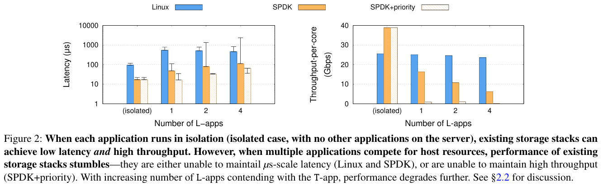
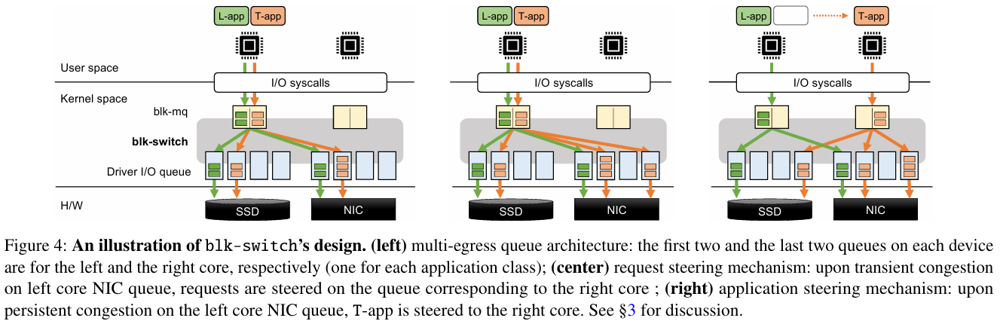

이번에 읽은 논문의 주제는 L-app(Latency-sensitive App)과 T-app(Throughput-bound App)이 실행 중인 환경에서 발생하는 요청 순서 문제를 해결하는 것이다.
저자들은 **Linux Storage Stack**과 **SPDK(Storage Performance Development Kit)**를 중점적으로 분석하여, 어떤 문제가 있는지 정의한다.

### Linux Storage Stack
Linux Storage Stack의 여러 가지 최적화 기법(Per-core Queues, Per-core Storage & Network Processing)에도 불구하고 **멀티 테넌트 환경에서 HoL(Head of Line) Blocking**으로 인해 성능 저하를 겪고 있으며, L-apps와 T-apps가 Host Resources를 두고 경쟁할 때 더욱 심해진다.
- µs 수준의 Latency 달성을 위해선, Compute, Storage, Network의 세심한 조율이 필요.
- 현재 Linux는 이를 해결하지 못해 저자들의 실험에서 **최대 7배의 Tail-latency가 발생.**

### SPDK
Per-core 기반의 SPDK은 Polling 방식으로 Low Latency를 달성할 수 있으나, 다수의 Apps이 동일한 코어에 위치하는 경우 **Storage Stack과 CPU Scheduler**로 인해 예상치 못한 병목이 발생한다.
- 저자들의 실험 환경에서 **최대 5배의 Tail-latency 상승과 2.5배의 Throughput 저하**가 발생.
- L-apps에 Priority를 제공하게 되면 T-apps의 Throughput이 0에 가까워짐. 

*Figure 2*는 L-app과 T-app을 isolated로 수행한 것과 L-apps의 수를 늘려가며 동시에 수행한 결과를 나타낸다. Linux가 가장 큰 평균 지연을 보여주지만, L-apps의 수가 늘어날 수록 SPDK의 Tail-latency가 더 높아지는 것을 볼 수 있다. 또한 SPDK의 Polling 기법이 CPU Scheduler인 CFS와 잘 맞지 않기 때문에 Tail-latency와 Throughput이 가장 크게 떨어진다고 설명한다.
- 저자들은 이를 *"blk-mq, CPU-efficient remote storage stacks"* 등의 최신 최적화 기법으로 인한 결과라고 한다.

이렇듯 Per-core 기반의 구조에서 동일 Core에 여러 패턴의 Apps이 동시에 동작할 경우 큰 성능 저하를 보이는 문제를 알 수 있다.
이를 해결하기 위해 저자들은 **Blk-switch**를 제안한다.

## Blk-switch
Blk-switch는 **Linux Per-core Block Multi-queues 구조**와 **Network Switch**가 유사하다는 통찰을 기반으로 하여 Apps가 제출한 요청이 **시스템의 어떤 코어에서도 처리할 수 있도록** 설계되었으며, 다음과 같은 주요 동작을 포함한다.
1. **Block Layer is the New Switch**
2. **Request Steering**
3. **Application Steering**

*Figure 4*는 Blk-switch의 아키텍처와 **주요 동작 1, 2, 3번을 나타낸다.**

### Block Layer is the New Switch
오늘 날의 Linux Block Multi-queues 구조는 Per-core 마다 Device Queues와 1:1로 매핑된다. 이러한 구조로 인해 한 코어에서 여러 애플리케이션이 동작할 경우 HoL 문제가 발생할 수 있다.
저자들은 이를 해결하기 위해 **Multiple Egress Queues** 구조와 **Decoupling Request Processing from Application Cores** 기법을 도입했다.
- **Multiple Egress Queues**:
    - 요청을 다른 Device Core로 전달할 수 있다고 하여도 Software Queue가 하나라면 동일 CPU의 App들의 요청에서 HoL이 발생할 수 있다.
    - 이를 해결하기 위해 **App Class마다 Egress Queue를 생성**하여, 각 Egress Queue에는 동일 Class의 요청만 삽입하도록 한다.
    - CPU Scheduler는 Application의 성능 목표(Latency | Throughput)에 따라 **우선순위**를 할당하여 L-apps의 요청이 먼저 처리되도록 한다.
- **Decoupling Request Processing from Application Cores**:
    - Linux Block Multi-queues는 CPU와 Device Queues와 1:1로 매핑되기 때문에 **Core를 효율적으로 사용하지 못하는 경우**가 생긴다.
    - C0에 여러 Apps가 몰려 있고 C1은 한가하다면, 사용할 수 있는 자원을 두고 경쟁을 하는 꼴이 된다.
    - 이를 방지하기 위해 C0의 Egress Queue에서 Deque된 요청을 다른 Core의 Device Queue에 삽입하고, 응답을 원래의 Core(C0)로 반환되게 한다.

### Request Steering
**Request Steering**은 일시적인 부하(Transient Load)를 처리하기 위해 설계되었다. T-app의 요청이 발생했을 때, 로컬 코어의 부하가 임계치보다 낮다면 해당 코어의 Egress Queue에 요청을 삽입한다. 만약 로컬 코어가 혼잡하다면, **Power-of-two Choices** 알고리즘을 사용하여 다른 코어 중 무작위로 두 개의 후보를 선정하고, 그 중 부하가 더 적은 코어로 요청을 스티어링한다.
- **부하 측정 기준**: T-app은 주로 I/O가 병목이므로, **Egress Queue에 대기 중인 요청들의 총 바이트 수**를 기준으로 부하를 측정한다.
- **응답 처리**: 다른 코어로 스티어링된 요청이 완료되면, Linux Block Layer의 태그 정보를 활용하여 원래 요청을 보낸 `kioctx`(Kernel I/O Context)를 찾아 응답을 올바르게 반환한다.

### Application Steering
Request Steerring이 요청 단위의 부하 분산이라면, **Application Steering**은 **지속적인 부하**를 해결하기 위해 스레드 단위로 CPU 자원을 재할당하는 기법이다.
- **동작 방식**: 특정 코어에서 L-apps와 T-apps 간의 경합이 지속적으로 감지되면, **Coarse-grained timescale**(기본 10ms) 주기로 동작하여 T-app 스레드 자체를 유후 코어로 이동시킨다.
- **구현**: Linux 커널의 `sched_setaffinity` 함수를 사용하여 실행 중인 스레드를 물리적으로 다른 코어로 마이그레이션한다.
- **가중치 기반 부하 계산**: L-apps와 T-apps의 간섭을 최소화하기 위해 **Weighted Average Load**를 계산하여, T-app을 L-app의 부하가 적은 코어로 이동시킨다.

### Evaluation
저자들은 100Gbps 네트워크 환경에서 Linux, SPDK, Blk-switch의 성능을 비교 분석하였다. 실험은 In-memory Storage와 NVMe SSD 환경에서 진행되었으며, 주요 결과는 다음과 같다.

1. **L-apps의 Latency 유지**:
    - 다수의 L-apps와 T-apps가 경쟁하는 상황에서, Blk-switch는 Linux 대비 **평균 Latency를 최대 130배, P99 Tail Latency를 최대 25배 개선**하였다.
    - SPDK와 비교했을 때도 P99.9 Tail Latency에서 **33~101배 더 우수한 성능**을 보였다. 이는 SPDK의 폴링 방식이 CFS 스케줄러와 충돌하여 발생하는 문제를 해결했기 때문이다.
2. **T-apps의 Throughput 보장**:
    - Blk-switch는 Linux의 Throughput 대비 약 **84~100% 수준을 유지**하며, 하드웨어 대역폭을 거의 포화 상태까지 활용할 수 있게 한다.
    - Request Sterring 오버헤드로 인해 5~10%의 Throughput 손실이 발생할 수 있지만, us 단위의 Latency 보장을 고려하면 합리적인 Trade-off 관계라고 한다.
3. **확장성**:
    - 코어 수를 늘려감에 따라 Blk-switch는 선형적인 Throughput 증가를 보였으며, NUMA 노드를 넘나드는 환경에서도 안정적인 성능을 유지했다.

### Conclusion
저자들은 Linux 커널의 스토리지 스택을 **Network Switch** 아키텍처와 유사하게 재설계하여 어플리케이션이나 하드웨어 수정 없이도 **us 수준의 Latency와 높은 Throughput**을 동시에 달성하였다.