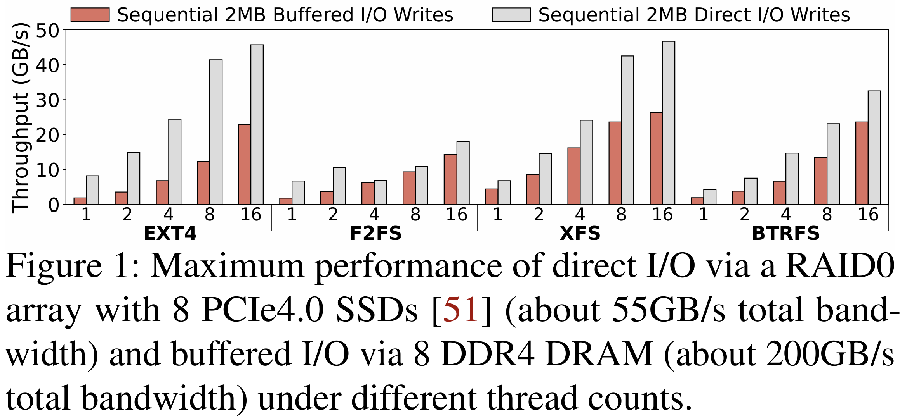
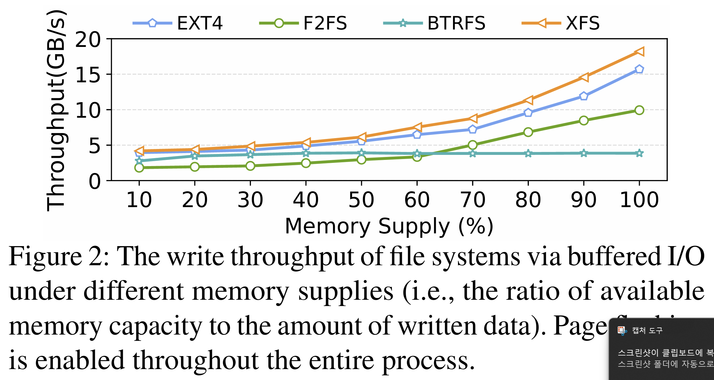
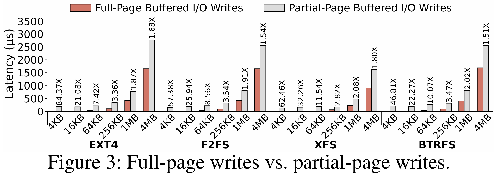
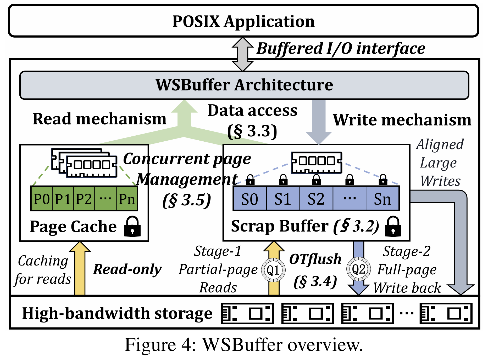
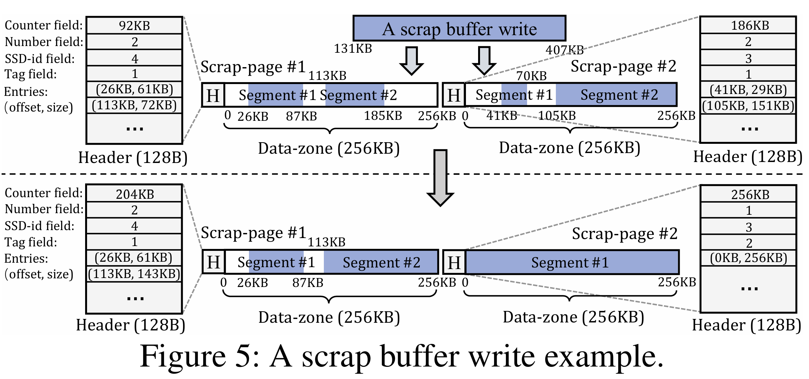
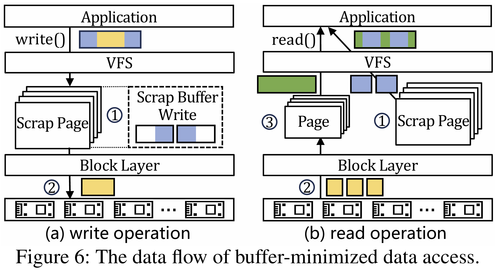
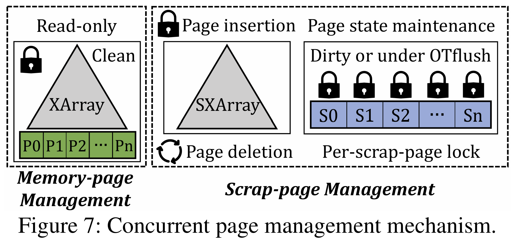
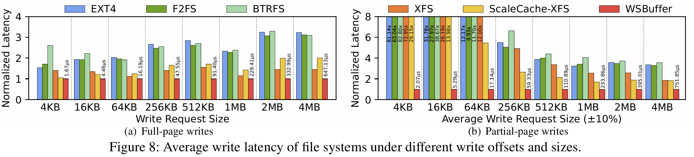
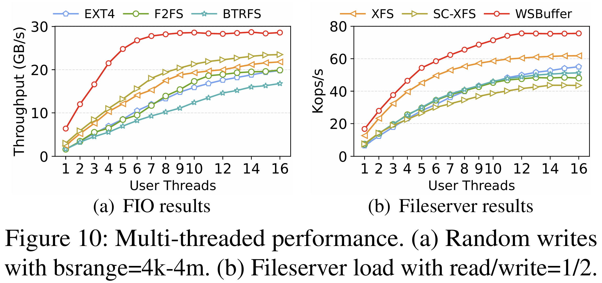
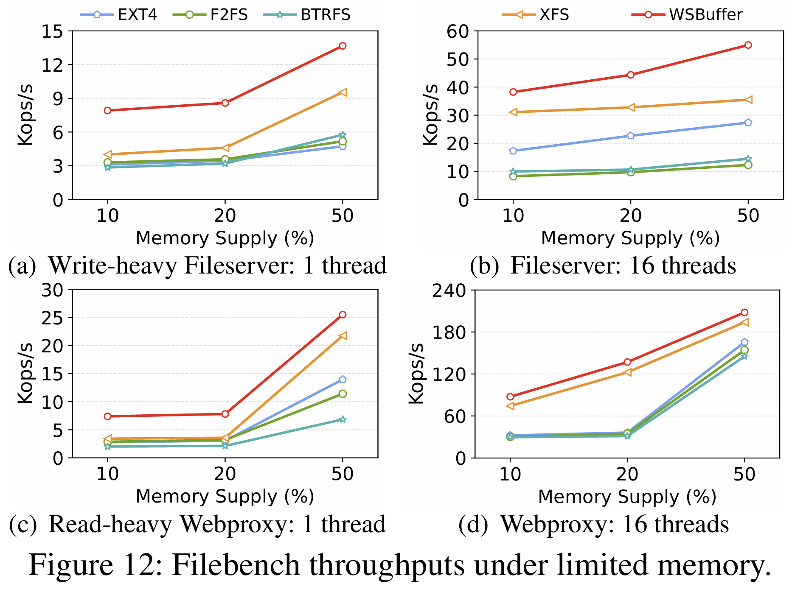

이번에 읽은 논문은 FAST(File and Storage Technicals) 2026년에 발표된 **Rearchitecting Buffered I/O in the Era of High-Bandwidth SSDs**다.

# 1. 서론
저장 장치 기술의 발전에 따라 NVMe(Non-Volatile Memory Express) SSD의 대역폭은 비약적으로 상승했다. 그러나 기존 운영체제의 Buffered I/O(페이지 캐시를 거치는 입출력 방식) 아키텍처는 수십 년 전 설계된 구조로, 최신 고대역폭 SSD의 성능을 충분히 활용하지 못하고 있다. 저자들은 이러한 한계를 극복하기 위해 쓰기 경로를 재설계한 **WSBuffer(Write-Scrap Buffering)** 를 제안한다.

# 2. 문제 정의 및 원인 분석
Buffered I/O가 고속 SSD 환경에서 성능을 내지 못하는 근본적인 원인을 세 가지 핵심 도전 과제로 정의한다.

## 2.1. 과도한 페이지 캐싱 오버헤드

**Fig 1.** 을 보면 Direct I/O(페이지 캐시를 거치지 않는 직접 입출력)가 모든 스레드 수에서 Buffered I/O보다 1.1배에서 4.46배 높은 성능을 보인다. 이는 메모리와 SSD 간의 대역폭 격차가 좁아지면서, 과거에는 무시할 만했던 페이지 할당, 조회, LRU 리스트 관리 등의 소프트웨어 오버헤드가 쓰기 경로의 치명적인 병목이 되었음을 시사한다.

## 2.2. 페이지 관리의 제한된 병행성

Buffered I/O는 과부하 쓰기 상황에서 메모리 의존성이 매우 높다. **Fig 2.** 는 공급되는 메모리 비율이 낮아질수록 쓰기 처리량이 급감함을 보여준다. 이는 XArray(리눅스 커널의 페이지 색인 구조) 업데이트 과정에서 발생하는 스핀 락 경쟁과 더티 페이지 플러싱 과정에서의 락 경합이 원인이다.

## 2.3. 부분 페이지 쓰기의 높은 페널티

페이지 경계와 일치하지 않는 부분 페이지 쓰기(Partial-page wirite)가 발생하면, 페이지 캐시는 유효한 데이터를 유지하기 위해 SSD에서 기존 데이터를 먼저 읽어오는 RBW(Read-Before-Write) 과정을 수행한다. **Fig 3.** 에서 확인할 수 있듯이, 부분 페이지 쓰기의 지연 시간은 전체 페이지 쓰기 대비 1.51배에서 84.37배까지 높게 나타나며, 이는 SSD의 긴 접근 지연 시간에 기인한다.

# 3. 제안 기법: WSBuffer (Write-Scrap Buffering)
WSBuffer는 Buffered I/O의 읽기 성능 이점은 유지하면서 쓰기 성능을 극대화하기 위해 데이터 경로를 재건축한다.

## 3.1. 스크랩 버퍼 (Scrap Buffer) 아키텍처

WSBuffer의 핵심은 페이지 캐시로부터 쓰기 버퍼링 기능을 분리한 **스크랩 버퍼** 구조다. **Fig 4.** 의 개요도와 **Fig 5.** 의 예시를 보면, 스크랩 버퍼는 128B 크기의 전용 헤더를 통해 부분 페이지 데이터의 세그먼트 정보를 관리하며, RBW 과정을 거치지 않고 사용자 쓰기를 즉시 수용한다.

## 3.2. 버퍼 최소화 데이터 접근 및 OTflush

WSBuffer는 정렬된 대형 쓰기 요청을 SSD로 직접 전송하여 메모리 점유를 최소화한다. **Fig 6.** 는 이러한 데이터 흐름을 보여주며, **Algorithm 1**의 메커니즘을 통해 데이터 일관성을 유지한다. 또한, **OTflush(Opportunistic Two-stage flushing)** 기법은 SSD의 부하를 감지하여 유휴 상태일 때 비동기적으로 스크랩 페이지를 채우고(Stage-1), 대규모 다누이로 일괄 기록(Stage-2)하여 입출력 효율을 높인다.

## 3.3 병행 페이지 관리 (SXArray)

기존 페이지 캐시의 락 경합 문제를 해결하기 위해, WSBuffer는 읽기 전용 페이지는 XArray로, 쓰기 전용 스크랩 페이지는 수정된 **SXAraay**로 분리하여 관리한다. **Fig 7.** 을 보면 SXArray는 지연된 트리 업데이트와 세밀한 페이지 다누이 락을 도입해 병행성을 극대화했음을 알 수 있다.

# 4. 성능 평가
저자들은 리눅스 커널 6.8 기반의 XFS 파일 시스템 상에 WSBuffer를 구현하여 평가를 진행했다.

## 4.1 쓰기 지연 시간 개선 (Microbenchmark)

**Fig 8.** 의 결과를 보면, WSBuffer는 Fio에서 기존 시스템 대비 월등한 성능을 보인다. 특히 부분 페이지 쓰기 상황(Fig 8-b)에서 스크랩 버퍼를 통한 RBW 패널티 제거 덕분에 지연 시간을 최대 82.8배 단축하는 성과를 거두었다.

## 4.2 다중 스레드 확장성 및 복합 워크로드

**Fig 10.** 은 다중 스레드 환경에서의 성능을 보여준다. 스레드 수가 증가함에 따라 WSBuffer의 처리량은 기존 파일 시스템보다 1.21배에서 3.91배 더 가파르게 상승한다. 이는 SXArray의 높은 병행성 덕분에 락 경합 없이 SSD 대역폭을 충분히 활용할 수 있음을 증명한다.

## 4.3 제한된 메모리 환경에서의 효율성

실제 운영 환경과 유사한 메모리 제약 상황에서의 성능을 평가한 **Fig 12.** 를 보면, WSBuffer는 메모리 공급량이 10%~50% 수준인 극한 상황에서도 기존 대비 1.23배에서 4.48배 높은 처리량을 유지한다. 이는 직접 쓰기를 통해 더티 페이지 증가를 방지하고, 절약된 메모리를 읽기 가속에 활용할 수 있기 때문이다.

# 5. 결론
WSBuffer는 고대역폭 SSD 시대에 Buffered I/O가 나아갈 새로운 방향을 제시한다. 쓰기 경로에서의 불필요한 페이지 캐시 오버헤드를 제거하고, SSD의 대역폭을 최대한 활용함으로써 성능 향상과 자원 효율성을 모두 달성하였다. 특히 리눅스 커널의 I/O 스택 비효율성을 연구하는 관점에서, SXArray와 같은 병행성 최적화 구조와 비동기 RBW 처리 로직은 가치 있는 모델이 될 것이다.