이번에 읽은 논문은 FAST(File and Storage Technologies) 2026년에 발표된 **Lockify: Understanding Linux Distributed Lock Management Overheads in Shared Storage**이다. 이 논문은 공유 저장장치 환경에서 리눅스 분산 락 관리자(DLM)가 가지는 성능 병목 지점을 정밀하게 분석하고, 이를 개선한 Lockify 기법을 제안한다.

## 1. 문제와 원인 (Problem and Cause)

### 1.1 Background: 리눅스 커널 DLM의 동작 방식
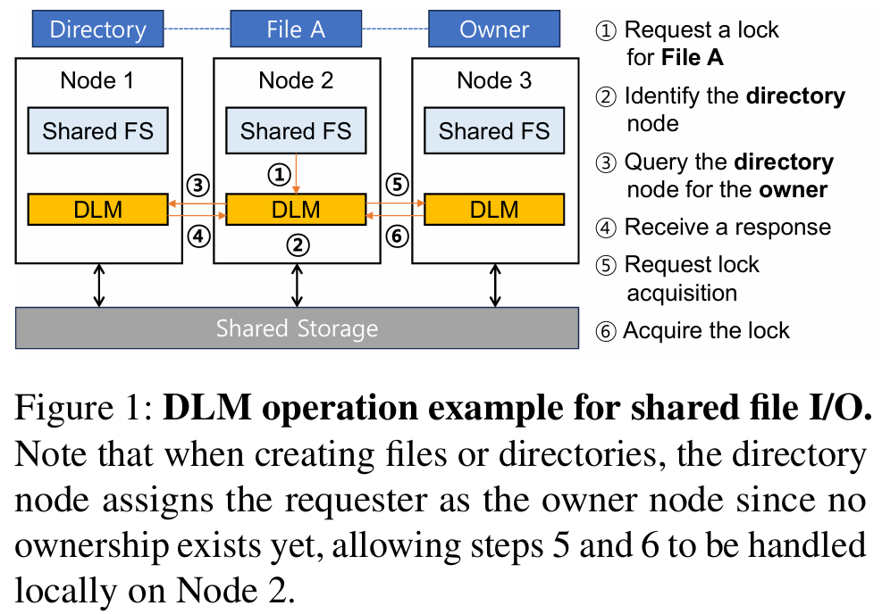

공유 디스크 파일 시스템(예: GFS2, OCFS2)은 여러 클라이언트가 동일한 저장 장치에 동시 접근할 때 데이터 일관성을 유지하기 위해 분산 락 관리자(DLM)를 사용한다. 리눅스 커널 DLM은 락 정보를 관리하기 위해 '해시(Hash)' 기반의 분산 구조를 채택하고 있다.
- 각 락 객체는 해시 함수에 의해 결정된 특정 **'디렉토리 노드(Directory Node)'** 에 할당된다.
- 클라이언트가 특정 파일에 대한 락을 획득하려면, 먼저 해당 파일의 디렉토리 노드에 접속하여 현재 해당 락을 소유하고 있는 **'소유 노드(Owner Node)'** 가 누구인지 조회해야 한다.
- 조회가 완료되면 실제 소유 노드에게 락 권한을 요청하고 승인받는 과정을 거친다. (**Figure 1** 참고)

### 1.2 문제 설명: Low-contention 상황에서의 확장성 결여
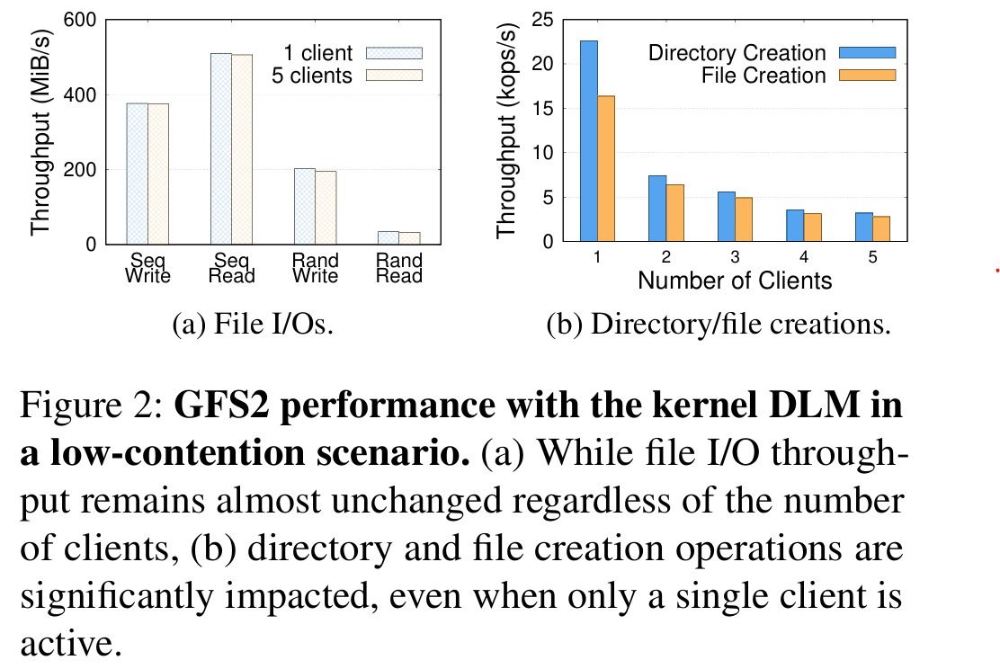

일반적으로 분산 락의 성능 저하는 여러 노드가 동일한 파일에 접근하는 '경합(Contention)' 상황에서 발생한다고 알려져 있다. 그러나 본 논문의 실험 결과에 따르면, 경합이 거의 없는(단일 노드만 활발히 파일을 생성하는) 상황에서도 클라이언트 노드 수가 증가하면 파일 시스템의 성능이 급격히 저하되는 현상이 발견되었다.
- GFS2 환경에서 단일 클라이언트가 파일을 생성할 때, 클라이언트 수가 1개에서 5개로 늘어남에 따라 처리량(Throughput)이 최대 86%까지 감소한다. (**Figure 2** 참고)
- 이는 실제 데이터 I/O 오버헤드보다 락 관리 오버헤드가 시스템 전체 성능의 병목이 되고 있음을 시사한다.

### 1.3 원인 분석: 락 소유자 조회의 높은 지연 시간(Latency)
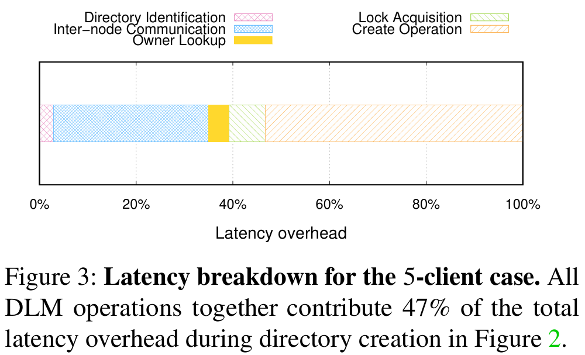
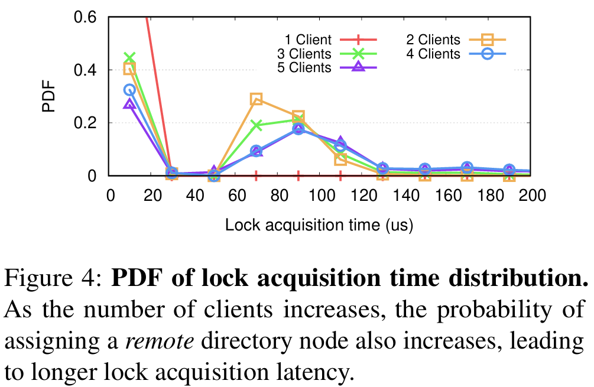
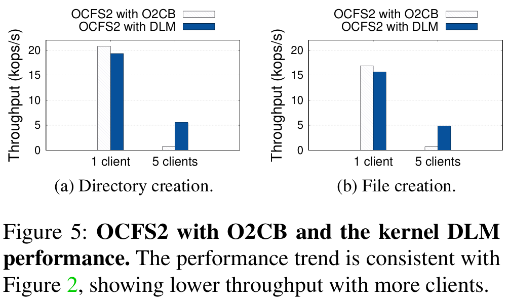

저자들은 지연 시간 분석(Latency Breakdown)을 통해 성능 저하의 결정적인 원인을 파악했다.
- **오버헤드 비중:** 파일 생성 작업 전체 지연 시간 중 약 47%가 DLM 작업에서 발생하며, 그 중에서도 디렉토리 노드를 통해 소유 노드를 조회하는 과정이 핵심적인 병목 지점이다. (**Figure 3** 참고)
- **확장성 한계:** 클라이언트 노드 수가 많아질수록 해시 함수에 의해 '원격 노드'가 디렉토리 노드로 지정될 확률이 높아지며, 이로 인해 발생하는 네트워크 왕복(Round-trip) 지연이 누적된다. (**Figure 4** 참고)
- **비교 분석:** OCFS2와 O2CB DLM 조합에서도 유사한 성능 저하 경향이 나타나며, 이는 특정 파일 시스템의 문제가 아닌 현재 DLM 설계 구조 자체의 근본적인 한계임을 증명한다. (**Figure 5** 참고)

## 2. 아이디어 (Idea)

### 2.1 아이디어의 배경: 생성 시점의 무소유 상태
기존 DLM의 가장 큰 낭비는 **이미 존재하지 않는 정보**를 찾기 위해 네트워크 통신을 수행한다는 점이다. 새로운 파일이나 디렉토리가 생성되는 시점에는 아직 어떤 노드도 해당 객체에 대한 락 소유권을 가지고 있지 않다. 저자들은 이 '무소유(No ownership)' 상태에 주목하여, 생성 노드가 굳이 디렉토리 노드에게 소유자를 묻는 과정을 거치지 않고 스스로를 즉시 소유자로 지정(Self-designation)해도 안전하다는 통찰을 얻었다.

### 2.2 주요 메커니즘 (Key Mechanisms)
이 아이디어를 실현하기 위해 Lockify는 두 가지 핵심 메커니즘을 제안한다.

1. **자가 소유 알림 (Self-owner Notifications):**
   파일 생성 요청 시, 생성 노드는 디렉토리 노드에게 "누가 소유자입니까?"라고 묻는 대신, "내가 소유자가 되었습니다"라고 일방적으로 통보한다. 이 알림은 비동기적으로 처리되므로, 생성 노드는 응답을 기다리지 않고 즉시 파일 생성 작업을 완료할 수 있어 동기적 네트워크 지연을 완전히 제거한다.

2. **비동기 소유권 관리 (Asynchronous Ownership Management):**
   비동기 통보 방식에서 발생할 수 있는 신뢰성 문제를 해결하기 위한 안전장치다. 생성 노드는 알림을 보낸 후 확인(Confirmation) 메시지를 받을 때까지 해당 요청을 관리하며, 만약 디렉토리 노드가 장애로 인해 알림을 받지 못하더라도 재전송이나 타임아웃 처리를 통해 시스템 전체의 락 정보 일관성을 유지한다. (**Figure 6** 참고)

## 3. 제안 기법 (Proposed Technique)
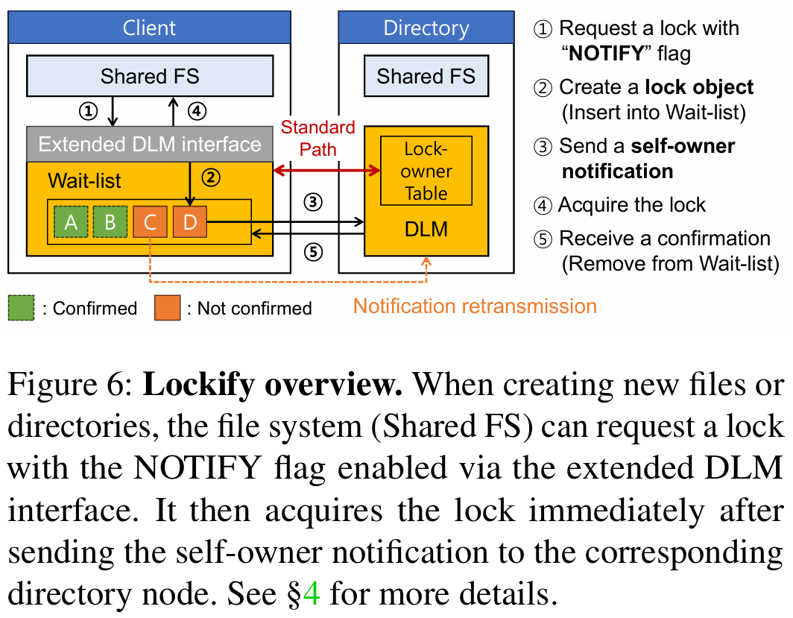

Lockify는 기존 DLM의 표준 워크플로우를 크게 수정하지 않으면서도 성능을 극대화하기 위해 세 가지 주요 기술적 요소를 도입했다. (**Figure 6** 참고)

### 3.1 자가 소유 알림 (Self-Owner Notifications)
기존 리눅스 커널 DLM은 락 소유권 조회를 위해 디렉토리 노드에 질의(Query)하고 응답을 기다리는 동기적 과정을 거친다. 하지만 논문의 4.1절에서 설명하듯, DLM은 존재하지 않는 파일이나 디렉토리에 대해서는 소유권 정보를 별도로 추적하지 않는다. 
Lockify는 이 점을 활용하여, 파일 생성 요청 시 생성 노드가 디렉토리 노드에게 질의하는 대신 **"내가 이 파일의 소유자가 되었다"** 고 선언하는 **'알림(Notification)'** 방식을 사용한다. 
- **작동 원리:** 생성 노드는 디렉토리 노드에 알림을 보낸 직후, 응답을 기다리지 않고 즉시 제어권을 파일 시스템 레이어로 반환한다. 
- **효과:** 이를 통해 소유권 조회를 위한 네트워크 왕복(Round-trip) 시간을 완전히 제거하며, CPU 효율성을 높여 파일 생성 성능을 비약적으로 향상시킨다.

### 3.2 확장된 락 획득 인터페이스 (Extended Lock Acquisition Interface)
Lockify는 기존 파일 시스템이 이러한 자가 소유 메커니즘을 쉽게 활용할 수 있도록 4.2절에서 새로운 인터페이스를 제안한다. 
- **NOTIFY 플래그:** 기존 `dlm_lock()` 함수에 새로운 `NOTIFY` 플래그를 추가했다. 파일 시스템(예: GFS2)이 새로운 객체를 생성할 때 이 플래그를 사용하여 락을 요청하면, Lockify 레이어는 이를 자가 소유 알림으로 인식한다.
- **적용 범위:** 이미 존재하는 파일에 대한 락 요청은 기존의 표준 소유자 조회 방식을 따르지만, 파일이나 디렉토리 생성(Creation)과 같이 소유권이 아직 할당되지 않은 특수한 상황에서만 `NOTIFY` 플래그가 활성화되어 최적화된 경로를 탄다.

### 3.3 비동기 소유권 관리 (Asynchronous Ownership Management)
비동기적으로 알림을 보내는 방식은 성능상 이점이 크지만, 네트워크 장애나 노드 크래시 발생 시 소유권 정보의 정합성이 깨질 위험이 있다. 이를 해결하기 위해 4.3절에서는 신뢰성 있는 관리 기법을 상세히 기술한다.
- **대기 목록(Wait-list):** 생성 노드는 알림을 보낸 후 해당 요청을 내부의 **'대기 목록'** 에 유지한다. 디렉토리 노드는 알림을 받아 자신의 락 소유권 테이블을 업데이트한 후 확인(Confirmation) 메시지를 보내며, 생성 노드는 이 메시지를 수신한 후에만 대기 목록에서 해당 항목을 삭제한다.
- **재전송 및 복구:** 일정 시간 동안 확인 메시지가 오지 않을 경우, 생성 노드는 알림을 재전송하여 디렉토리 노드가 정확한 정보를 가지도록 보장한다. 노드 장애 시에도 기존의 DLM 복구 프로토콜과 연동되어 미확인된 소유권 정보를 다시 동기화하므로 파일 시스템의 강한 일관성(Strong Consistency)을 훼손하지 않는다. (**Figure 6** 참고)

## 4. 성능 측정 (Performance Evaluation)

저자들은 5대의 서버로 구성된 테스트베드 환경에서 Lockify의 성능을 검증했다. 기존 리눅스 커널 DLM, OCFS2의 O2CB, 그리고 NFS와 비교 분석을 수행했다.

### 4.1 Low-contention 상황에서의 확장성 (**Figure 7**)
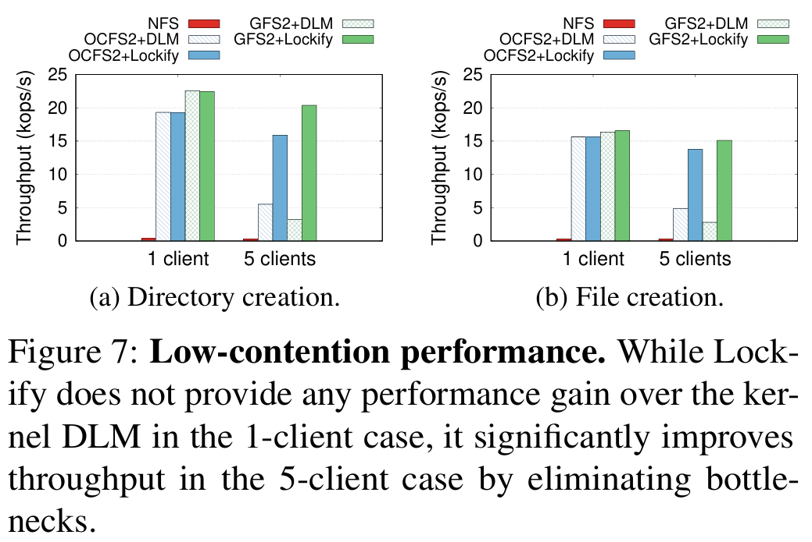

경합이 거의 없는 상황에서 클라이언트 수를 1개에서 5개로 늘리며 성능을 측정했다.
- **결과:** 기존 DLM은 클라이언트 수가 증가함에 따라 원격 디렉토리 노드에 접근할 확률이 높아져 성능이 급감했지만, Lockify는 클라이언트 수와 상관없이 단일 노드일 때와 유사한 높은 처리량을 유지했다.
- **성능 향상:** 5개 클라이언트 환경에서 기존 DLM 대비 약 **6.4배** 높은 처리량을 기록했다.

### 4.2 High-contention 상황에서의 성능 (**Figure 8**)
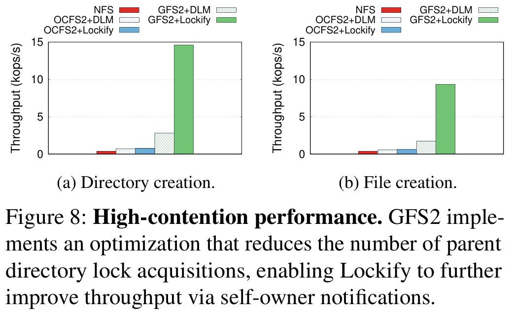

모든 클라이언트가 동일한 부모 디렉토리 아래에서 파일을 생성하여 락 경합이 발생하는 상황을 시뮬레이션했다.
- **결과:** 부모 디렉토리에 대한 락 획득 과정이 병목이 되어 성능 향상 폭은 줄어들었지만, Lockify는 여전히 기존 DLM 대비 **1.09~1.11배**의 성능 우위를 보였다.
- **분석:** GFS2 자체의 최적화와 Lockify의 비동기 알림이 결합되어 경합 상황에서도 오버헤드를 최소화함을 확인했다.

### 4.3 지연 시간 오버헤드 분석 (**Figure 9**)
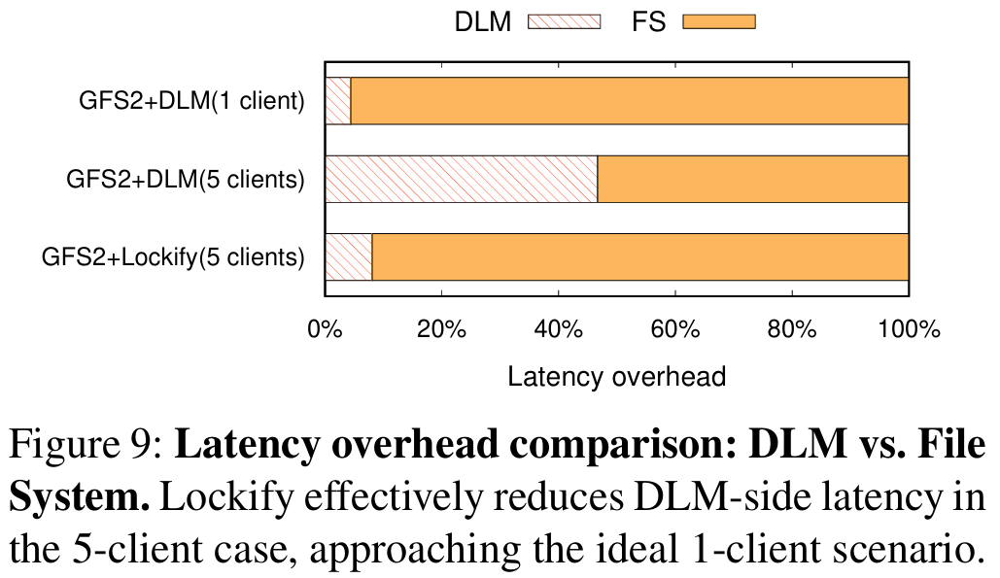

파일 시스템 전체 지연 시간 중 DLM이 차지하는 비중을 분석했다.
- **결과:** 기존 DLM은 지연 시간의 약 46.7%가 DLM 작업에서 발생했으나, Lockify는 이를 **8%** 수준으로 대폭 낮췄다.
- **의미:** 이는 Lockify가 락 관리 오버헤드를 거의 이상적인 수준(단일 노드 환경)으로 최적화했음을 보여준다.

### 4.4 실제 워크로드 테스트 (Postmark & Filebench) (**Figure 10**)
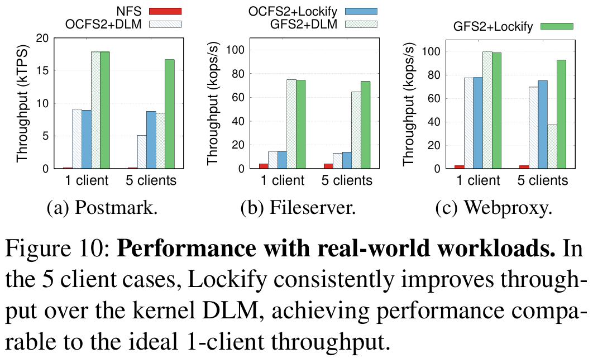

Postmark와 Filebench(fileserver, webproxy) 등 실제 애플리케이션 워크로드를 사용하여 성능을 측정했다.
- **Postmark:** 5개 클라이언트 환경에서 기존 DLM 대비 **1.7~2.0배**의 성능 향상을 보이며 이상적인 성능의 93~96%를 달성했다.
- **Filebench:** 파일 생성, 삭제가 빈번한 fileserver 워크로드에서 약 **1.14~2.5배**의 성능 향상을 기록했다.

### 4.5 RDMA 기반 DLM과의 비교 (**Figure 11**)
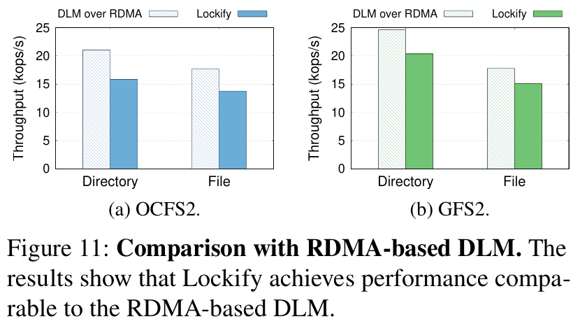

고속 네트워크 하드웨어를 사용하는 RDMA 기반 DLM 솔루션(에뮬레이션)과 비교를 수행했다.
- **결과:** Lockify는 전용 하드웨어 지원 없이 소프트웨어적인 최적화만으로도 RDMA 기반 솔루션 성능의 **87~88%** 수준에 도달했다.
- **결론:** 이는 비싼 하드웨어 교체 없이도 범용적인 TCP/IP 환경에서 충분히 높은 분산 락 성능을 낼 수 있음을 입증한다.

**최종 결론:**
Lockify는 공유 저장장치 환경에서 고속 SSD의 대역폭을 가로막던 분산 락의 조회 병목을 '자가 소유 선언'이라는 역발상을 통해 해결했다. 특히 기존 인프라를 그대로 유지하면서도 소프트웨어 레이어의 수정만으로 비약적인 성능 향상을 이뤄냈다는 점이 이 논문의 가장 큰 가치라고 할 수 있다.
